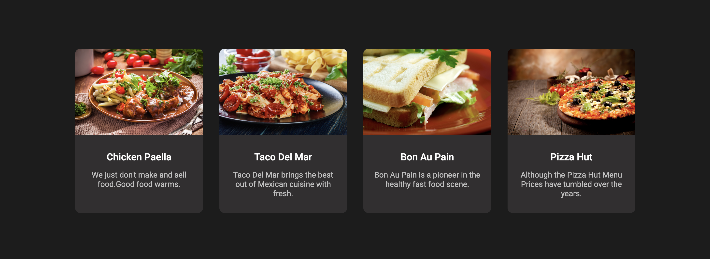
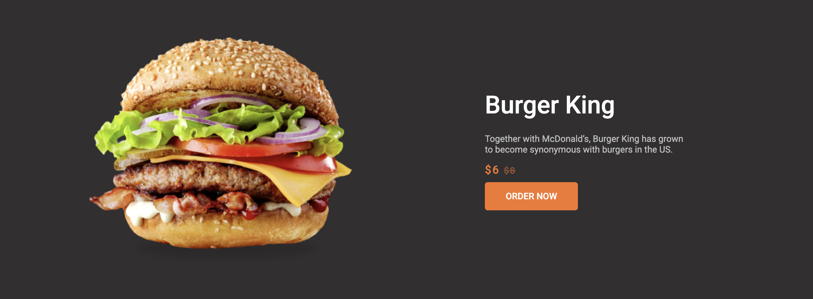
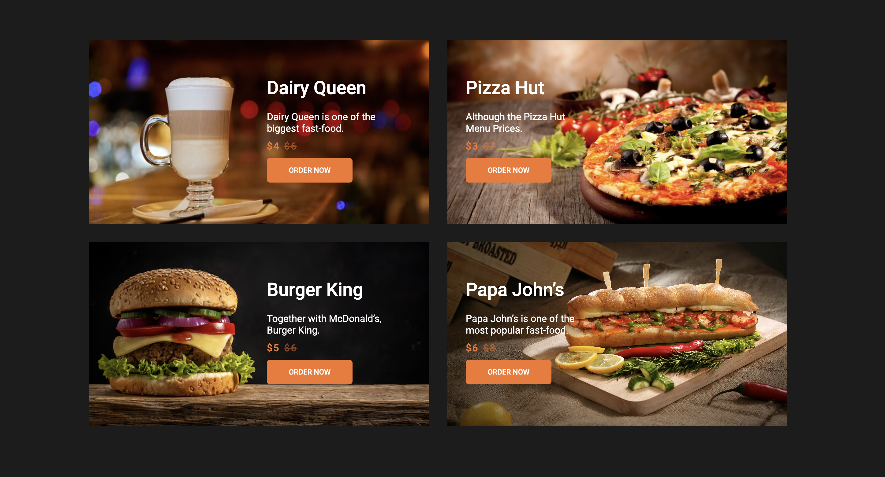
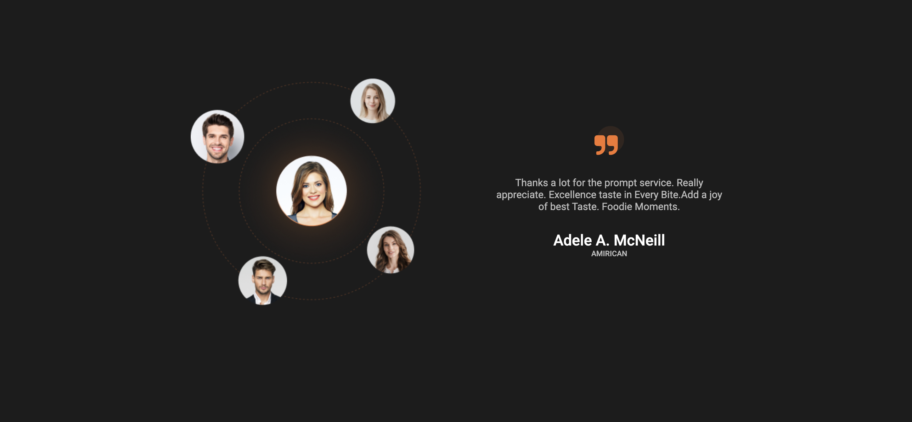
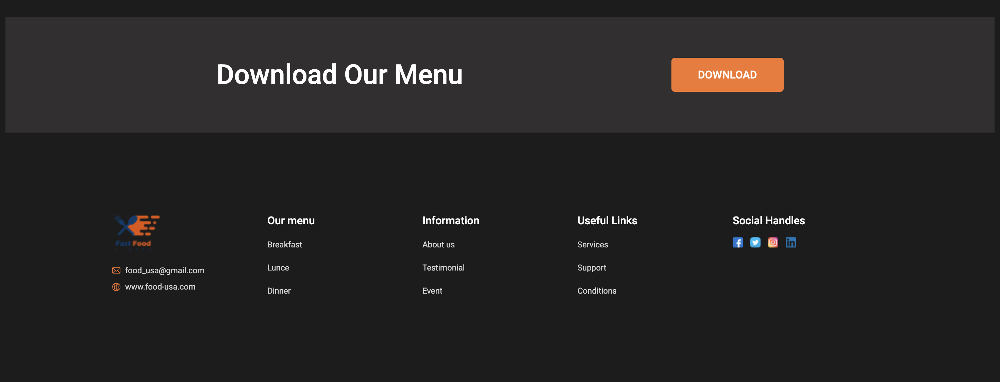

# Burger Landing

HTML, CSS and BEM methodology were used during development. Responsive design for tablets and phones has also been added.

## Getting Started
1. Open `index.html` in any brawser.